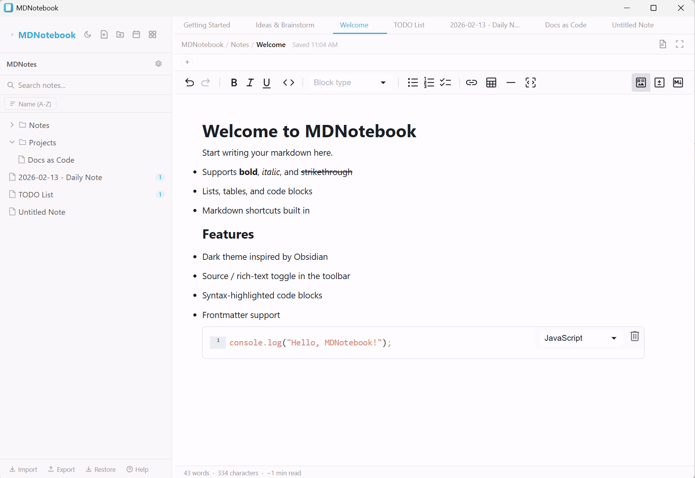
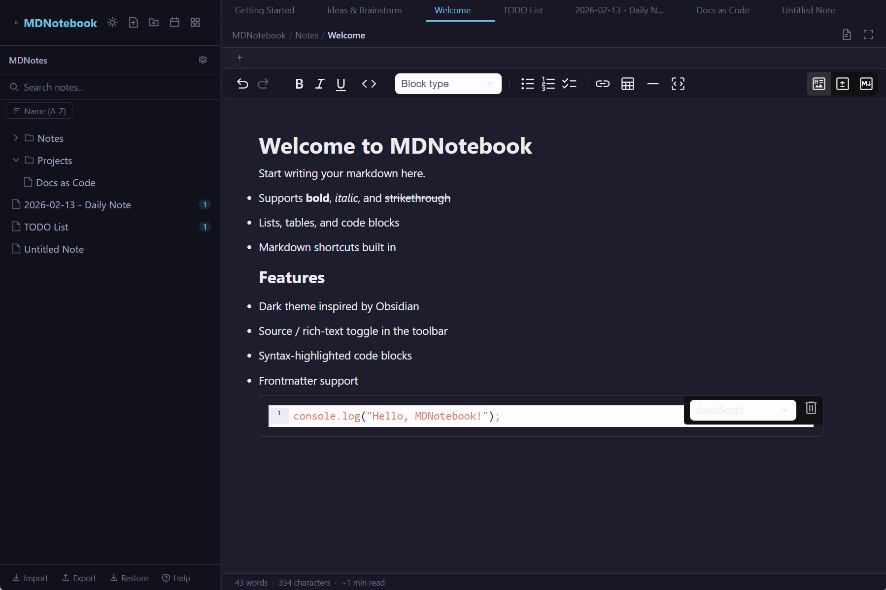
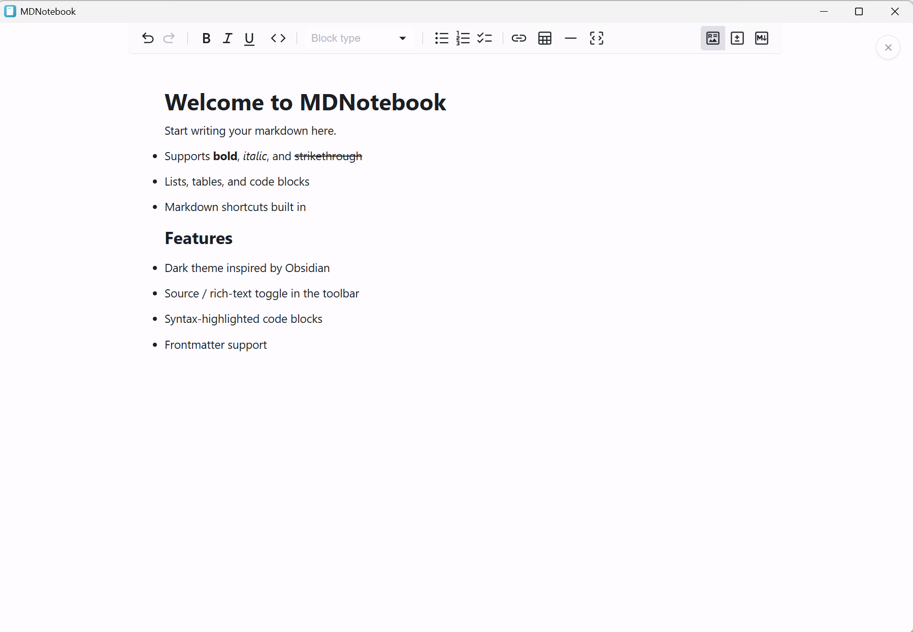
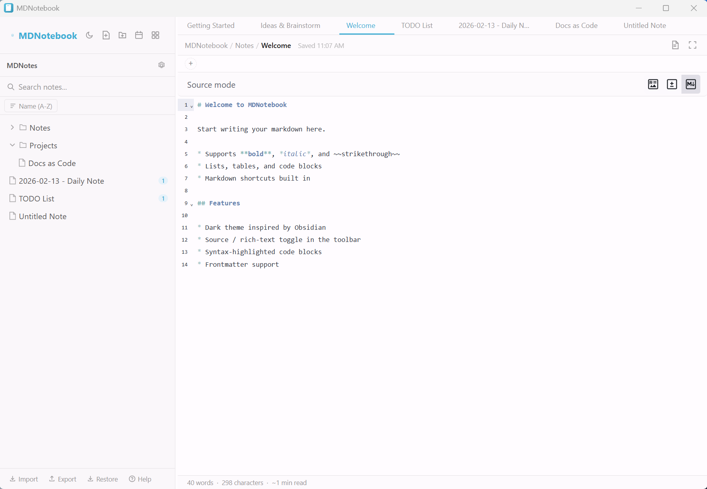

<p align="center">
  
</p>

<h1 align="center">MDNotebook</h1>

<p align="center">
  An offline, encrypted markdown notebook built for technical writing.
  <br />
  Write privately. Organize freely. Export to Docs as Code.
</p>

<p align="center">
  <a href="https://github.com/iamcarrasco/MDNotebook/releases/latest"><strong>Download for Windows</strong></a>
</p>

---

## Why MDNotebook?

You write meeting notes, standards, patterns, blueprints, daily logs — then publish them through a Docs as Code pipeline (Hugo, MkDocs, Docusaurus). Most note apps either sync your data to someone else's cloud or export flat text with no metadata.

MDNotebook does one thing well: **private, structured note-taking that produces publish-ready Markdown.**

```
Write  ──>  Organize  ──>  Export .md with YAML frontmatter  ──>  Docs as Code platform
```

No accounts. No cloud. No telemetry. Your vault is AES-256-GCM encrypted on your machine and never leaves it.

## Screenshots

| Light Mode | Dark Mode |
|:---:|:---:|
|  |  |

| Zen Mode | Source View |
|:---:|:---:|
|  |  |

---

## Download

Pre-built Windows installers — no dependencies required:

| Installer | Format |
|-----------|--------|
| [MDNotebook_0.2.1_x64-setup.exe](https://github.com/iamcarrasco/MDNotebook/releases/download/v0.2.1/MDNotebook_0.2.1_x64-setup.exe) | NSIS (recommended) |
| [MDNotebook_0.2.1_x64_en-US.msi](https://github.com/iamcarrasco/MDNotebook/releases/download/v0.2.1/MDNotebook_0.2.1_x64_en-US.msi) | MSI |

> Windows may show a SmartScreen warning since the app is not code-signed. Click **"More info"** then **"Run anyway"** to proceed.

---

## Features

### Write

- **Rich editor** — WYSIWYG toolbar with bold, italic, headings, code blocks, tables, task lists, and images. Stored as standard Markdown. Toggle between rich-text, source, and diff views
- **Admonitions** — `:::note`, `:::tip`, `:::info`, `:::caution`, `:::danger` callout blocks for technical documentation
- **Mermaid diagrams** — Live-rendered diagram blocks (flowcharts, sequence diagrams, etc.)
- **YAML frontmatter** — Per-note metadata editor (author, status, category, custom fields). Exported as a YAML block for static site generators
- **Templates** — Quick-create Blank Note, Daily Note, or Meeting Notes in one click. Categorized template picker (Quick, Planning, Reflection) with custom template support
- **Zen mode** — Distraction-free fullscreen writing
- **Encrypted images** — Paste or drag images; each is encrypted as a separate vault asset

### Organize

- **Folders** — Nest notes in folders, drag and drop to reorder
- **Tabs** — Open multiple notes side by side, reorder with drag and drop
- **Tags** — Filter by AND/OR logic with a collapsible sidebar panel
- **Wiki links** — `[[Note Name]]` syntax with a backlinks panel
- **Full-text search** — Search names and content with preview snippets
- **Daily notes** — One-click daily note with `Ctrl+Shift+T`, auto-tagged `#daily`
- **Version history** — Save and restore snapshots, auto-snapshot on note switch
- **Command palette** — `Ctrl+Shift+P` to search and execute any action

### Export

| Format | What you get |
|--------|-------------|
| **Markdown** | Single note or bulk export with YAML frontmatter, vault images embedded as base64 |
| **HTML** | Self-contained styled HTML document |
| **PDF** | Print-ready via the native print dialog |
| **JSON backup** | Full vault backup (tree + trash) for restore |

Frontmatter output for Docs as Code platforms:

```yaml
---
title: "Access Review Standard"
date: 2026-02-26T10:00:00.000Z
lastmod: 2026-02-26T14:30:00.000Z
tags:
  - "iam"
  - "standards"
author: "A. Carrasco"
status: "draft"
---
```

### Secure

| | |
|---|---|
| **Encryption** | AES-256-GCM with PBKDF2 (600,000 iterations) |
| **Storage** | Passphrase never stored; atomic writes prevent corruption |
| **Images** | Each image individually encrypted as a vault asset |
| **Network** | Zero outbound connections |
| **Telemetry** | None — no analytics, no tracking, no cloud sync |

### Desktop

- **System tray** — Runs in the background, hides on close
- **Global hotkey** — `Ctrl+Shift+M` brings the app to focus from anywhere
- **File associations** — Double-click `.md` files to import them
- **Dark mode** — Light, dark, or follow system. Title bar follows theme
- **Windows 11 Mica** — Native backdrop effect
- **Auto-save** — Saves after you stop typing (configurable 200ms–5000ms)

---

## Build from Source

### Prerequisites

- [Node.js](https://nodejs.org/) >= 22.12.0
- [Rust](https://www.rust-lang.org/tools/install) (latest stable)
- [Tauri CLI prerequisites](https://tauri.app/start/prerequisites/) for Windows

### Commands

```bash
npm install          # Install dependencies
npm run tauri dev    # Development mode
npm test             # Run tests
npm run tauri build  # Production build (outputs MSI + NSIS installers)
```

---

## Tech Stack

| Layer | Technology |
|-------|-----------|
| Frontend | Next.js 16, React 19, TypeScript |
| Backend | Tauri 2 (Rust) |
| Editor | MDXEditor (Lexical) |
| Encryption | Web Crypto API (PBKDF2 + AES-256-GCM) |
| Diagrams | Mermaid.js |
| Drag & Drop | @dnd-kit |
| Testing | Vitest |

---

## License

[MIT](LICENSE)
